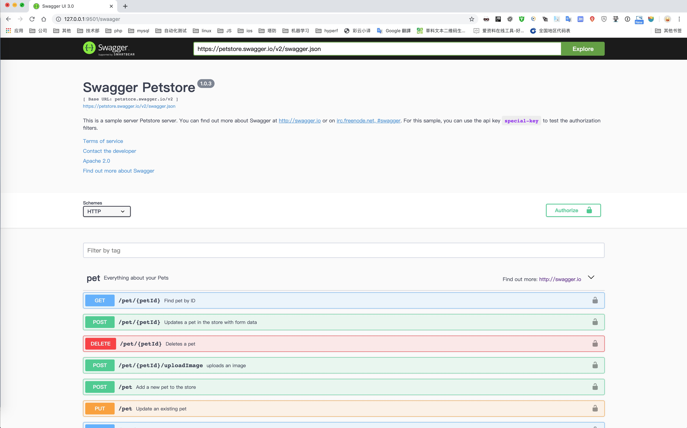
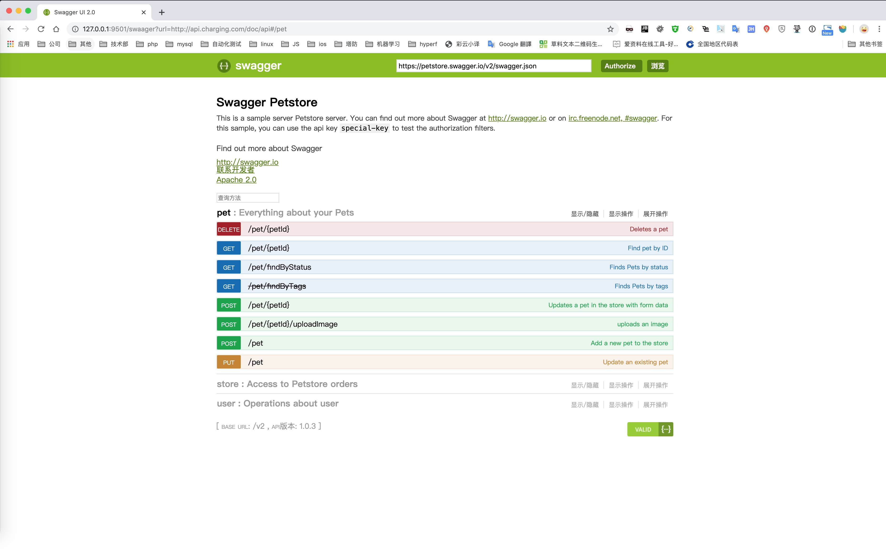
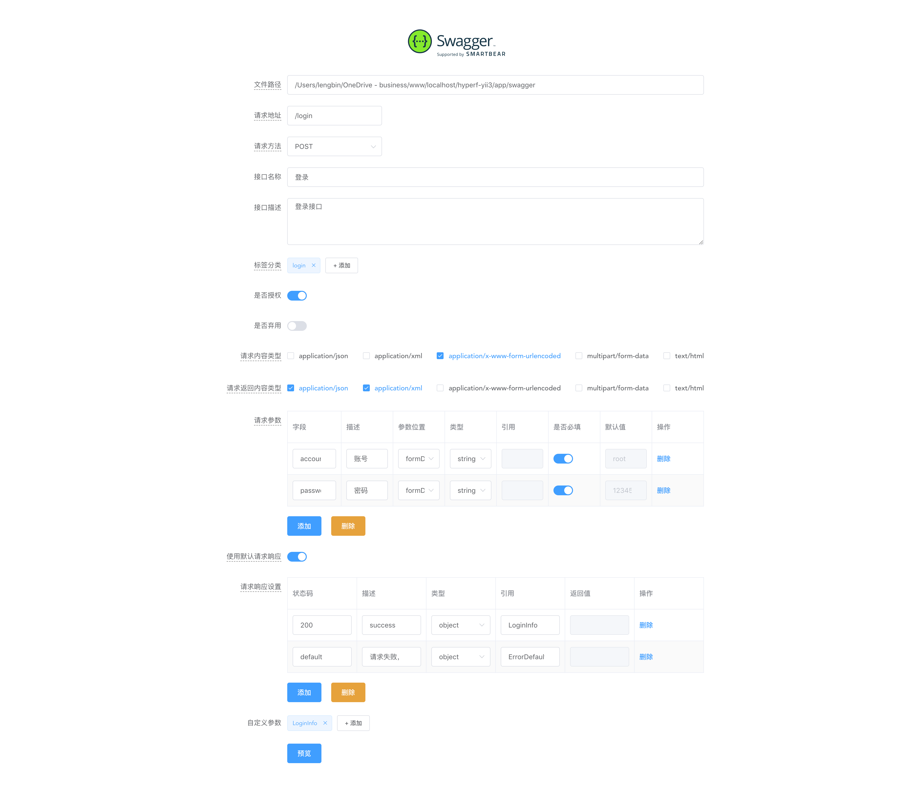
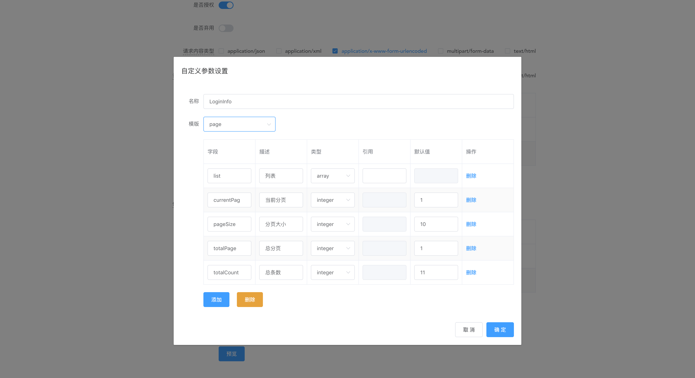

<p align="center">
    <a href="https://hyperf.io/" target="_blank">
        
    </a>
    <h1 align="center">Hyperf Swagger</h1>
    <br>
</p>

If You Like This Please Give Me Star

Install
------------

The preferred way to install this extension is through [composer](http://getcomposer.org/download/).

Either run

```
composer require lengbin/hyperf-swagger
```

or add

```
"lengbin/hyperf-swagger": "*"
```
to the require section of your `composer.json` file.


Request
-------
```
"zircote/swagger-php": "2.0.14"
```

If want to test api .
Please look [annocation](https://blog.csdn.net/dyt19941205/article/details/79025266)


Publish
-------
```php
      
php ./bin/hyperf.php vendor:publish lengbin/hyperf-swagger

``` 

Configs
-----
``` php
	// 静态资源 配置 /config/autoload/server.php
    
    return [
        ......
        
        settings => [
            ......
        
            // 静态资源
            'document_root' => BASE_PATH . '/public',
            'static_handler_locations' => ['/'],
            'enable_static_handler' => true,

            ......
        ],

        ......
    ]
	// 发布后生成配置文件
	// 路径为 /config/autoload/swagger.php
	
	return [
		//static path (dir name) , eg:  'swagger' or '/swagger'
		'path'               => 'swagger',
		// generator annotation file path
		'filePath'           => BASE_PATH . '/runtime/swagger',
		//api url
		'url'                => '/swagger/api',
		//  swagger version , support 2, 3, default 3
		'version'            => \Lengbin\Hyperf\Swagger\Swagger::SWAGGER_VERSION_DEFAULT,
		// The OAuth Configration
		'oauthConfiguration' => [],
		// generator config
		'generator'          => [
			// http method , eg: get, post, delete put
			'httpMethods'     => [],
			// content-type, eg: "application/json", "application/x-www-form-urlencoded"
			'contentTypes'    => [],
			//Parameters of the position, eg: "formData", "path", "query", "header", "body"
			'parameterIns'    => [],
			// Parameter type, eg: "string", "number", "integer", "boolean", "file"
			'parameterTypes'  => [],
			// definition type, eg: "array" , "object" , "string", "number", "integer", "boolean"
			'definitionTypes' => [],
			// default value
			'default'         => [
				// open response template
				"openResponseTemplate" => false,
				/**
				 * response default definition template, eg:
				 *'responseTemplate' => [
				 *  'code' => 0,
				 *  'message' => 'Success',
				 *  'data' => '{{replace}}',
				 *],
				 */
				'responseTemplate'     => [],
				/**
				 * parameters
				 * [
				 *  [
				 *      "name" => "token",
				 *      "description" => "Token",
				 *      "in" => "header",
				 *      "type" => "string",
				 *      "ref" => "",
				 *      "required" => "yes", // "yes" or "no"
				 *      "default" => "1",
				 *  ]
				 * ]
				 */
				'parameters'           => [],
				/**
				 * responses
				 * [
				 *  [
				 *   "status"      => 200,
				 *   "description" => "success",
				 *   "type"        => "object",
				 *   "ref"         => "SuccessDefault",
				 *   "example"     => '',
				 *  ]
				 * ]
				 */
				'responses'            => [
					[
						"status"      => 200,
						"description" => "success",
						"type"        => "object",
						"ref"         => "SuccessDefault",
						"example"     => '',
					],
					[
						"status"      => "default",
						"description" => "请求失败， http status 强行转为200, 通过code判断",
						"type"        => "object",
						"ref"         => "ErrorDefault",
						"example"     => '',
					],
				],
				/**
				 * definition select template, eg:
				 */
				'definitionTemplate'   => [
					'default' => [],
					'page'    => [
						[
							'property'    => 'list',
							'description' => '列表',
							'type'        => 'array',
							'ref'         => '',
							'example'     => '',
						],
						[
							'property'    => 'currentPage',
							'description' => '当前分页',
							'type'        => 'integer',
							'ref'         => '',
							'example'     => 1,
						],
						[
							'property'    => 'pageSize',
							'description' => '分页大小',
							'type'        => 'integer',
							'ref'         => '',
							'example'     => 10,
						],
						[
							'property'    => 'totalPage',
							'description' => '总分页',
							'type'        => 'integer',
							'ref'         => '',
							'example'     => 1,
						],
						[
							'property'    => 'totalCount',
							'description' => '总条数',
							'type'        => 'integer',
							'ref'         => '',
							'example'     => 11,
						],
					],
				],
			],
		],
	];
	
```
>访问接口 /swagger/api，如果配置文件修改filePath路径，将在 project/runtime/swagger 文件下生成3个默认文件
> - swagger.php
> - error.php （一些自定义参数demo，可以删除）
> - tag.php （分类注释demo，可以删除）
> 修改 swagger.php， host为您的域名， 可以模拟测试


Usage
-----
```php

<?php

namespace App\Controller;

use Hyperf\Di\Annotation\Inject;
use Hyperf\HttpServer\Annotation\Controller;
use Hyperf\HttpServer\Annotation\GetMapping;
use Lengbin\Hyperf\Swagger\Swagger;

/**
 * Class SwaggerController
 * @package App\Controller
 * @Controller()
 */
class SwaggerController extends AbstractController
{

    /**
     * @Inject()
     * @var Swagger
     */
    public $swagger;

    /**
     * swagger ui 
     * @GetMapping(path="/swaager")
     */
    public function index()
    {
        return $this->swagger->html();
    }

    /**
     * swagger open api
     * @GetMapping(path="/swagger/api")
     */
    public function api()
    {
        // 扫码目录path
        $path = dirname(__DIR__) . DIRECTORY_SEPARATOR . 'swagger';
        return $this->swagger->api([
            $path,
        ]);
    }
    
    /**
     * swagger web -> generator annotation
     * @GetMapping(path="/swagger/generator")
     */
    public function generator()
    {
        return $this->swagger->generator($this->request);
    }

    /**
     * swagger web api
     * @RequestMapping(path="/swagger/annotation", methods={"GET", "POST"})
     */
    public function annotation()
    {
        // 扫码目录path, 生成注释文档目录
        $path = dirname(__DIR__) . DIRECTORY_SEPARATOR . 'swagger';
        return ['code' => 0, 'message' => 'Success', 'data' => $this->swagger->annotation($this->request, $path)];
    }

}

```

Todo list
--------
 - [x] Swagger Ui2
 - [x] Swagger Ui3
 - [x] Read Swaager Annotation Generator Openapi
 - [x] [Swaager Generator Annotation](https://github.com/ice-leng/vue-swagger)
 - [ ] Other Swagger Ui Theme


Screenshots
-----------




